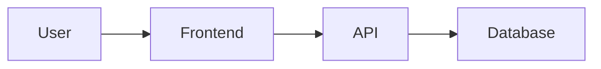

# Debrief

Explain what was just built in plain, engaging language. Help Mike understand the architecture, decisions, and lessons — not just the code.

---

## Step 1: Detect Mode

| Command | Mode | Description |
|---------|------|-------------|
| `/debrief` | Quick | 2-3 paragraph summary, key takeaways |
| `/debrief deep` | Deep | Full explanation with code snippets, diagrams |
| `/debrief quiz` | Quiz | Deep explanation + 2-3 retention questions at end |

---

## Step 2: Detect Scope

**Check for recent changes:**
```bash
git diff --stat HEAD~3
git log --oneline -5
```

**Context-aware scope:**
- **Recent build phase detected** (meaningful commits in last hour, uncommitted changes): Focus on what just got built (micro)
- **No recent changes / mid-project**: Provide system architecture overview (big picture)

If unclear, ask Mike: "Want me to debrief the recent changes or give you the big picture of how this project works?"

---

## Step 3: Gather Context

### For Recent Changes (Micro)
1. Run `git diff` and `git log` to see what changed
2. Read the modified files to understand the implementation
3. Check for any error patterns in recent commits (bug fixes)
4. Identify new dependencies or technologies added

### For Big Picture (System Architecture)
1. Read project structure: `package.json`, main entry points
2. Identify core components and how they connect
3. Map the data flow through the system
4. Note key technologies and why they were chosen

---

## Step 4: Generate Debrief

### Tone Guidelines

**DO:**
- Write like you're explaining to a smart friend over coffee
- Use analogies: "Think of this like a restaurant — the API is the waiter, the database is the kitchen"
- Be direct: "Here's the deal..." / "The key insight is..."
- Make it memorable with concrete examples
- Explain the WHY, not just the what

**DON'T:**
- Sound like dry documentation or a textbook
- Use jargon without explaining it
- Focus on syntax — focus on concepts and architecture
- Be boring

### Content Structure

**Quick Mode:**
```
## What We Built
[2-3 sentences on what was accomplished]

## How It Works
[Brief explanation of the architecture/flow]

## Key Decisions
[1-2 most important technical choices and why]

## Watch Out For
[Any gotchas or things to remember]
```

**Deep Mode:**
```
## What We Built
[Detailed explanation of what was accomplished]

## Architecture Overview
[ASCII diagram or description of how components connect]

┌─────────────┐     ┌─────────────┐     ┌─────────────┐
│   Client    │────▶│   API       │────▶│  Database   │
└─────────────┘     └─────────────┘     └─────────────┘

## The Data Flow
[Step-by-step: User does X → triggers Y → results in Z]

## Technical Decisions
[For each major decision:]
- What we chose: [X]
- Why not [alternative]: [reason]
- Trade-off: [what we gained vs gave up]

## Code Highlights
[Key snippets with explanation — not dumps, just the interesting parts]

## Bugs & Fixes
[Any issues encountered and how they were resolved]

## Pitfalls to Avoid
[Future gotchas and how to prevent them]

## New Tech Introduced
[Any new libraries, patterns, or platforms — and why they matter]

## Engineering Lessons
[Best practices demonstrated, how senior engineers think about this]
```

**Quiz Mode:**
Same as Deep Mode, plus:
```
---

## Quick Check

Test your understanding:

1. [Question about the core concept]
2. [Question about a decision/trade-off]
3. [Question about the data flow or architecture]
```

---

## Step 5: Save to File

After displaying in terminal, save the debrief as a markdown file.

**Path:** `C:\Users\myann\OneDrive\Desktop\LifeOS\advisors\learning-coach\ai-engineering\debriefs\`

**Naming:** `YYYY-MM-DD_short-description.md`
- Use today's date
- Keep description under 30 characters
- Use lowercase with hyphens
- Examples: `2026-01-25_auth-flow.md`, `2026-01-25_stripe-integration.md`

**File enhancements:**
- Add Mermaid diagrams for architecture (renders in Obsidian/GitHub):

- Include links to relevant files in the codebase
- Add a "Session Context" header with project name and date

---

## Step 6: Confirm

Tell Mike:
- What was debriefed (recent changes or system overview)
- Where the file was saved
- Offer to go deeper on any specific topic

**Example:**
> Debriefed the Stripe integration we just built. Saved to `debriefs/2026-01-25_stripe-integration.md`.
>
> Want me to go deeper on how webhooks work, or quiz you on the payment flow?

---

## Examples

### Quick Debrief Example

> ## What We Built
> We added user authentication using NextAuth.js with Google OAuth. Users can now sign in with their Google account, and their session persists across page refreshes.
>
> ## How It Works
> Think of it like a bouncer at a club. When someone tries to enter (access a protected page), the bouncer (middleware) checks if they have a wristband (session token). No wristband? They get redirected to the entrance (login page) to get one from Google.
>
> ## Key Decisions
> We went with NextAuth over rolling our own auth because it handles the OAuth dance, session management, and token refresh automatically. Building this from scratch would've taken days and introduced security risks.
>
> ## Watch Out For
> The session callback in `auth.ts` is where you add custom fields to the session. If you need user roles or other data, that's where it goes.

### Deep Debrief with Diagram

> ## Architecture Overview
>
> ```
> ┌──────────────┐         ┌──────────────┐         ┌──────────────┐
> │   Browser    │────────▶│  Next.js     │────────▶│   Google     │
> │              │◀────────│  (NextAuth)  │◀────────│   OAuth      │
> └──────────────┘         └──────────────┘         └──────────────┘
>        │                        │
>        │                        ▼
>        │                 ┌──────────────┐
>        └────────────────▶│   Database   │
>                          │  (sessions)  │
>                          └──────────────┘
> ```
>
> The flow: User clicks "Sign in" → redirected to Google → Google confirms identity → NextAuth creates a session → session stored in database → user redirected back with a cookie.
